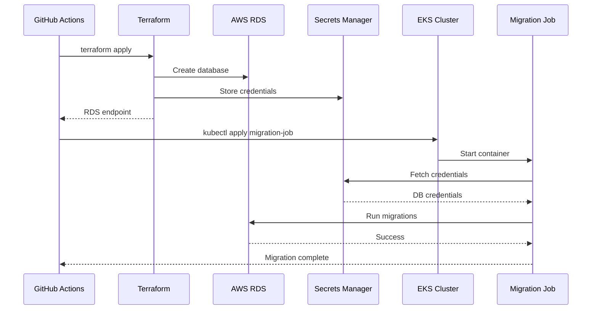

# Database Migration Automation

## Overview

This repository implements **fully automated database migrations** that run automatically when RDS is provisioned, without any human intervention.

## How It Works

### 1. **Terraform Provisions RDS** (via CI/CD)

```
GitHub Actions → Terraform Apply → RDS Created → Secrets Manager Updated
```

### 2. **Automated Migration Job Triggers** (immediately after)

```
kubectl configured → Kubernetes Job created → Migrations run → Pods ready
```

### 3. **Zero Manual Steps Required**

The entire flow is automated in the CI/CD pipeline.

## Architecture

### Components

#### 1. `k8s/migration-job.yaml`

**Kubernetes Job** that:
- Runs as a one-time Job (not Deployment)
- Fetches DB credentials from AWS Secrets Manager automatically
- Installs Prisma CLI and dependencies
- Generates Prisma Client from schema
- Runs `prisma migrate deploy`
- Deletes itself after 300 seconds (TTL)

#### 2. `scripts/run-migrations-auto.sh`

**CI/CD automation script** that:
- Configures `kubectl` to connect to EKS cluster
- Creates ConfigMap with Prisma schema files
- Applies the migration Job to Kubernetes
- Waits for completion and reports status

#### 3. `.github/workflows/terraform.yml`

**GitHub Actions workflow** that:
- Runs Terraform to provision RDS
- Automatically triggers `run-migrations-auto.sh` after apply
- Reports migration status in job summary

## Workflow Sequence



## Files

### Manual Script (for local use)

- **`scripts/run-migrations.sh`**: Requires human to manually fetch credentials and run

### Automated Pipeline (no human required)

- **`k8s/migration-job.yaml`**: Kubernetes Job definition
- **`scripts/run-migrations-auto.sh`**: CI/CD automation script
- **`.github/workflows/terraform.yml`**: Integrated migration step

## Usage

### Automated (CI/CD) - Recommended

**No action required!** Migrations run automatically when:

1. You push to `develop` branch → Development migrations run
2. You push to `main` branch → Production migrations run

### Manual (Local Development)

If you need to run migrations locally:

```bash
cd scripts
./run-migrations.sh
```

## Environment Variables

The automation script uses:

| Variable | Default | Description |
|----------|---------|-------------|
| `ENVIRONMENT` | `development` | Target environment |
| `AWS_REGION` | `us-east-1` | AWS region |
| `AWS_ACCOUNT_ID` | `118735037876` | AWS Academy account |

## Migration Job Behavior

- **Restart Policy**: `OnFailure` (retries on failure)
- **Backoff Limit**: 3 retries maximum
- **TTL After Finished**: 300 seconds (auto-cleanup)
- **Service Account**: Uses `LabRole` for AWS access

## Monitoring

Check migration status:

```bash
kubectl get jobs -n ftc-app-development
kubectl logs job/database-migration -n ftc-app-development
```

## Troubleshooting

### Job Failed

```bash
kubectl describe job database-migration -n ftc-app-development
kubectl logs job/database-migration -n ftc-app-development
```

### Re-run Migration Manually

```bash
kubectl delete job database-migration -n ftc-app-development
cd scripts && ./run-migrations-auto.sh
```

### Clean Up Old Jobs

```bash
kubectl delete job database-migration -n ftc-app-development --ignore-not-found
```

## Security

- **Credentials**: Never stored in code, fetched from Secrets Manager at runtime
- **Service Account**: Uses AWS Academy `LabRole` (least privilege in Academy environment)
- **Network**: Job runs inside VPC, communicates with RDS via private subnet

## Benefits

✅ **Zero Manual Intervention**: Fully automated in CI/CD
✅ **Secure**: Credentials fetched dynamically from Secrets Manager
✅ **Idempotent**: Safe to re-run, Prisma handles migrations properly
✅ **Self-Cleaning**: Job auto-deletes after completion
✅ **Resilient**: Automatic retries on failure
✅ **Traceable**: Full logs in Kubernetes and GitHub Actions

## Differences from Manual Script

| Feature | `run-migrations.sh` | `run-migrations-auto.sh` |
|---------|---------------------|--------------------------|
| **Human Required** | ✅ Yes | ❌ No |
| **Credential Fetching** | Manual | Automatic (Secrets Manager) |
| **Execution** | Local terminal | Kubernetes Job in EKS |
| **CI/CD Integration** | ❌ No | ✅ Yes |
| **Auto-cleanup** | Manual | Automatic (TTL) |
| **Use Case** | Local dev | Production automation |
